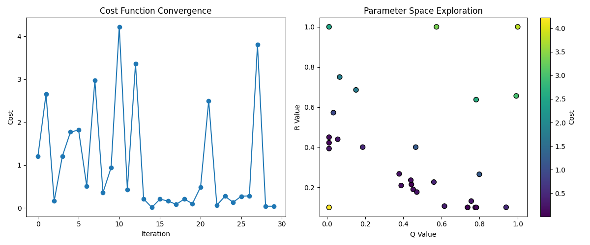
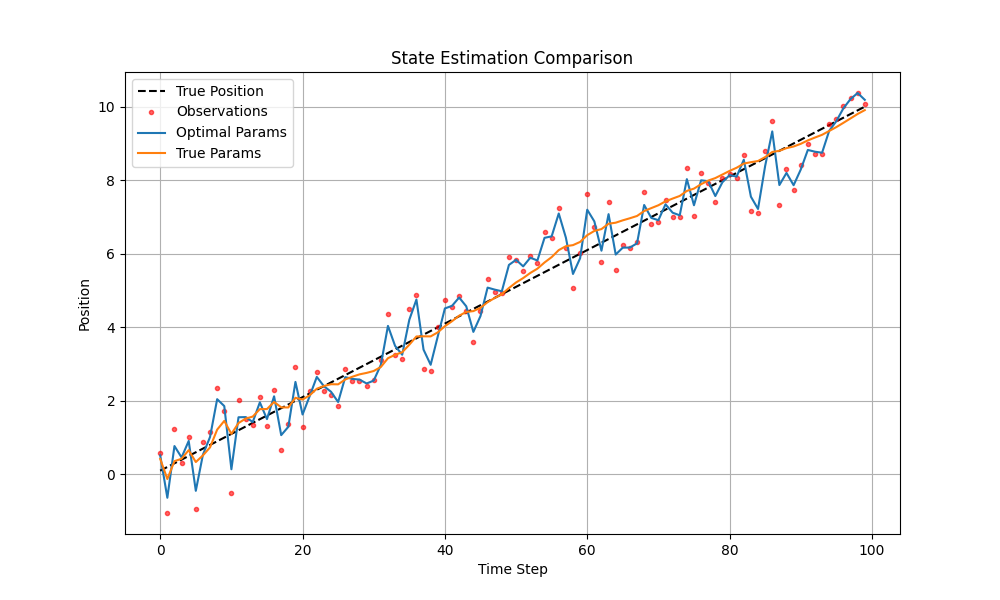

# KF Autotune

This project will handle Python based kalman filter autotuning code.
Details are not desined yet.

## 1 dimentional kf optimization

Try run 

```
python3 mock/kf_auto_tune_sample1d.py
```

or 

```
python3 main.py
```

You will get following figures.






